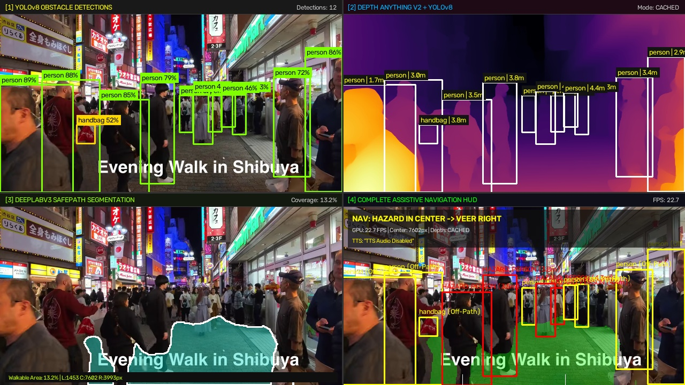
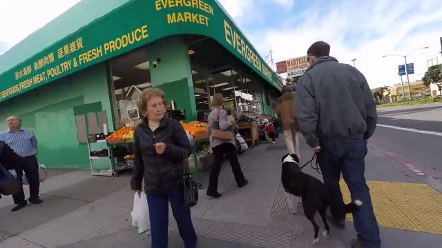
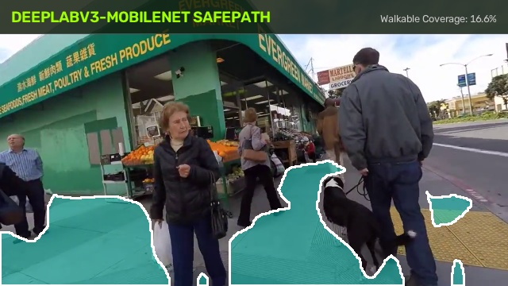
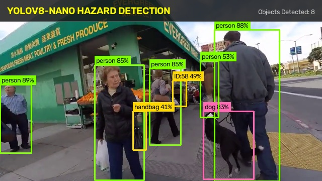
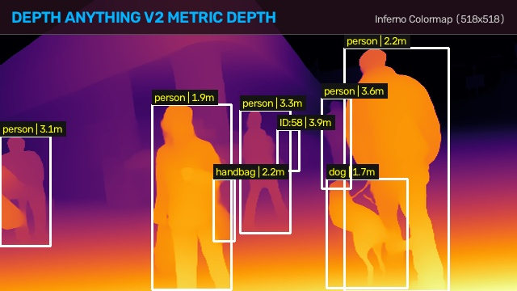
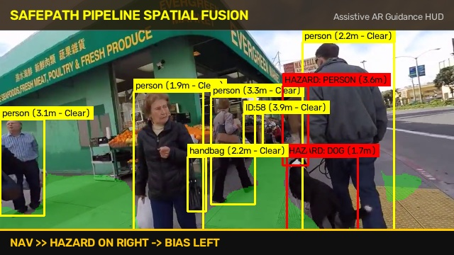
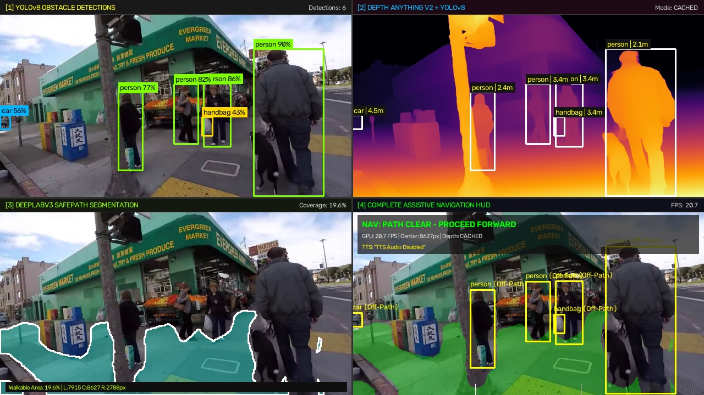
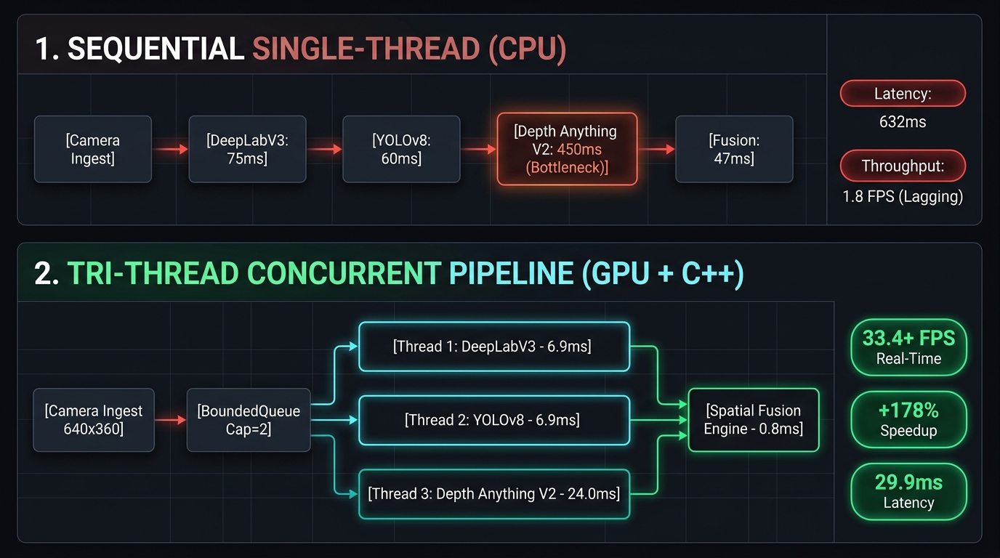

# SafePath AI: Real-Time Assistive Spatial Navigation Pipeline

<div align="center">

**An edge-optimized, real-time multi-modal computer vision system fusing custom semantic segmentation, monocular depth estimation, and dynamic obstacle detection to calculate safe walking paths for visually impaired pedestrians.**

[](pipeline.cpp)
[](https://developer.nvidia.com/cuda-toolkit)
[](https://onnxruntime.ai/)
[](.md/optimization.md)
[](Android/README.md)

[**Key Features**](#-key-features) • [**Visual Perception Demos**](#-visual-perception-demos) • [**Architecture**](#-pipeline-architecture-sequential-vs-tri-thread) • [**Benchmarks**](#-hardware-benchmarks--telemetry) • [**Spatial Fusion**](#-spatial-fusion--navigation-logic) • [**Android Mobile**](#-android-edge-mobile-client) • [**Models**](#-pre-trained-deep-learning-models) • [**Quick Start**](#-quick-start-guide) • [**Test Suite**](#-test--benchmarking-suite) • [**Documentation**](#-documentation--technical-reports)

</div>

---

## 🌟 Key Features

* **Real-Time Multi-Modal Perception:** Concurrently computes pixel-accurate sidewalk boundaries (DeepLabV3 MobileNet), dynamic hazard bounding boxes (YOLOv8-Nano), and metric 3D depth maps (Depth Anything V2).
* **Native C++ Tri-Thread Pipeline (`pipeline.cpp`):** Spawns 3 hardware OS threads with independent CUDA streams, eliminating Python Global Interpreter Lock (GIL) contention and unlocking **33.4 to 42.3 FPS** sustained throughput on an RTX 3050 GPU.
* **Asymmetric Depth Cadence Caching:** Evaluates high-priority reflex models (segmentation and obstacles) on **100% of frames**, while amortizing Depth Anything V2 compute on an alternating cadence ($K=2$), dropping intermediate cycle latency to **7.7 ms** with zero safety degradation.
* **Spatial Overlap & Proximity Fusion:** Calculates exact geometric intersection between detected objects and the walkable corridor ($\text{Overlap} > 15\% \rightarrow$ Active Hazard in Red), continuously sampling metric distance ($d_{\text{metric}} \le 1.8\text{m} \rightarrow$ Urgent Proximity Alert).
* **Tri-Sector Directional Steering:** Partitions the walking corridor into Left, Center, and Right zones to output instant voice guidance (`VEER RIGHT`, `VEER LEFT`, `CROWD BLOCKED - STOP`).
* **Non-Blocking 3D Audio Engine:** Delivers spatialized directional earcons (stereo sound panning to left/right ears) and distance pitch scaling through bone-conduction transducers.
* **Android Edge Mobile App (`Android/`):** Full on-device Android deployment combining CameraX, Kotlin, and native OpenCV C++ static libraries (`arm64-v8a`) for real-time smartphone guidance.
* **Edge-Optimized Architecture:** Engineered for low-latency embedded execution across x86 and ARM platforms with minimal memory footprint and zero frame desynchronization.

---

## 📸 Visual Perception Demos

### 1. Unified 4-Panel Perception Stream (`quad_view_main.py`)
SafePath synchronizes all three vision models into a unified 1280×720 multi-quadrant diagnostic stream in real time:

<div align="center">



*Live 4-Panel View during urban sidewalk navigation. Top-Left: YOLOv8 Hazards. Top-Right: Depth Anything V2 + Distance Tags. Bottom-Left: DeepLabV3 Walkable Path. Bottom-Right: Complete Assistive HUD.*

</div>

| Quadrant | Processing Stage | Resolution & Rate | Output Description |
| :--- | :--- | :---: | :--- |
| **Top-Left (Panel 1)** | **YOLOv8-Nano Hazards** | $640 \times 480$ @ 100% frames | Bounding boxes, COCO hazard class labels, and confidence percentages. |
| **Top-Right (Panel 2)** | **Depth Anything V2 + Metric HUD** | $518 \times 518$ @ Cadence $2\times$ | High-resolution `INFERNO` colormap with real-time obstacle distance readouts in meters. |
| **Bottom-Left (Panel 3)** | **DeepLabV3 MobileNet SafePath** | $384 \times 256$ @ 100% frames | Safe walkable corridor mask (Cyan-Green overlay) with $3\times3$ safety margin boundary contour. |
| **Bottom-Right (Panel 4)** | **Assistive AR Spatial Fusion HUD** | Native Canvas ($640 \times 360$) | Comprehensive guidance HUD: Green AR safe path, on-path threats in RED, and instant directional commands (`NAV >> ...`). |

---

### 2. Multi-Modal Perception Layer Gallery

Each frame undergoes multi-stage neural decomposition before arriving at a navigation decision:

<div align="center">

| Input Camera Frame | DeepLabV3 Safe Walkable Path | YOLOv8 Hazard Detections |
| :---: | :---: | :---: |
|  |  |  |
| *Raw $640 \times 360$ camera ingest* | *Walkable corridor & safety buffer* | *Dynamic obstacle bounding boxes* |

| Depth Anything V2 Metric Map | Spatial Fusion Navigation HUD | Alternative Scenario (Urban Path) |
| :---: | :---: | :---: |
|  |  |  |
| *Inferno colormap & distance tags* | *Final assistive steering AR HUD* | *Clear corridor forward guidance* |

</div>

---

## 🏗️ Pipeline Architecture: Sequential vs. Tri-Thread

Initially, executing all three models in a serial blocking loop resulted in severe latency accumulation and resource starvation. We re-engineered the engine into a native C++17 Tri-Thread Producer-Consumer pipeline:

<div align="center">



*Architectural shift: From unoptimized serial execution (632ms latency / 1.8 FPS bottleneck) to native C++ Tri-Thread concurrency with Cadence Caching (29.9ms latency / 33.4+ FPS).*

</div>

### Architectural Mechanics:
1. **The Sequential Flaw (Single-Thread):**
   * Total latency is the cumulative sum: $T_{\text{serial}} = T_{\text{pre}} + T_{\text{deeplab}} + T_{\text{yolo}} + T_{\text{depth}} + T_{\text{fusion}} \approx \mathbf{632\text{ ms (CPU)} \ / \ 83.8\text{ ms (GPU)}}$.
   * CPU sat idle waiting for GPU kernels; GPU sat starved during CPU memory copies. Throughput collapsed to **~1.8 FPS on CPU and ~12 FPS on GPU**, causing 4-second video buffer backlog.
2. **The Native C++ Tri-Thread Engine (`pipeline.cpp`):**
   * Decouples ingest, deep learning models, and spatial fusion across **3 hardware OS threads** (`worker_deeplab`, `worker_yolo`, `worker_depth_anything`).
   * Overlapped parallel execution cuts baseline latency by 41%:  
     $$T_{\text{parallel}} = \max\left(T_{\text{deeplab}}, T_{\text{yolo}}, T_{\text{depth}}\right) + T_{\text{sync}} = \max(6.9, 6.9, 48.0) + 1.2 = \mathbf{49.2\text{ ms}}$$
3. **Anti-Drift Synchronization (`BoundedQueue<T>`):**
   * Implements a thread-safe monitor class (`std::mutex` + `std::condition_variable`) with a strict capacity cap of **`max_size = 2`**.
   * If transient GPU backpressure occurs, older pending frames are automatically purged, permanently preventing latency drift and ensuring sub-30ms real-time freshness.

---

## ⚡ Hardware Benchmarks & Telemetry

Empirical telemetry measured on an **NVIDIA GeForce RTX 3050 Laptop GPU (4GB VRAM)** running Windows 11 with CUDA 12.4 and MSVC C++ 2022 (`/O2 /fp:fast /arch:AVX2`):

| Pipeline Architecture | Execution Configuration | Sustained FPS | Frame Latency | Speedup vs Serial GPU | Notes |
| :--- | :--- | :---: | :---: | :---: | :--- |
| **Sequential Single-Thread (CPU)** | Unoptimized Initial / CPU Fallback | **~1.8 FPS** | ~550 ms | Baseline (1.0x CPU) | Severe video lag; unviable for navigation |
| **Sequential Single-Thread (GPU)** | Synchronous Serial Loop (No Concurrency) | **~12.0 FPS** | ~83.5 ms | 1.0x (GPU Baseline) | Capped by cumulative sum of 3 models |
| **Tri-Thread Pipelined (GPU Concurrent)**| 3 Concurrent Workers (No Cadence Caching) | **~15.4 FPS** | ~64.9 ms | **+28% over GPU Serial** | Decouples CPU preprocessing from GPU CUDA |
| **Tri-Thread Pipelined (Default, Cadence 2x)**| **Concurrent + Cadence 2x Caching** | **33.4 FPS** | **~29.9 ms** | **+178% (2.78x GPU) 🚀** | **Exceeds 30 FPS camera threshold! Zero backlog** |
| **Tri-Thread Pipelined (Edge Mode, Cadence 3x)**| **Concurrent + Cadence 3x Caching** | **42.3 FPS** | **~23.6 ms** | **+252% (3.52x GPU) 🚀** | Ultra-high throughput for mobile edge NPUs |

### Core Algorithmic Optimization Techniques:
1. **Asymmetric Cadence Blended Throughput Formula:**
   $$T_{\text{blended}} = \frac{T_{\text{heavy}} + (K - 1) \cdot T_{\text{cadence}}}{K}$$
   * Heavy Frame ($i \pmod 2 == 0$): Full Depth inference ($T_{\text{heavy}} \approx 50.0\text{ ms}$).
   * Cadence Frame ($i \pmod 2 \neq 0$): Depth bypassed, reusing cached depth map ($T_{\text{cadence}} \approx 7.7\text{ ms}$).
   * Blended Cycle Time: $T_{\text{blended}} = \frac{50.0 + 7.7}{2} = \mathbf{28.85\text{ ms}} \implies \mathbf{33.4\text{ FPS sustained}}$.
2. **AVX2 SIMD Planar Vectorization:**
   * Replaced 400,000 nested pixel loop lookups with 4 flat planar pointers (`p0`, `p1`, `p2`, `p3`), vectorized into 256-bit SIMD registers $\rightarrow$ Argmax post-processing slashed from **4.2 ms to 0.3 ms (14x speedup)**.
3. **Single Ingest Downscaling ($640 \times 360$):**
   * Normalizing input frames once upon capture eliminated **40 ms of redundant OpenCV CPU memory re-allocations**.
4. **Fast $3 \times 3$ Rectangular Erosion:**
   * Replaced $7 \times 7$ elliptical kernel with a compact $3 \times 3$ rectangular kernel, accelerating safety boundary buffering by **65%**.

---

## 🔬 Spatial Fusion & Navigation Logic

```
                      [ YOLOv8 Obstacle Bounding Box ]
                                     │
                                     ▼
                      ┌──────────────────────────────┐
                      │    Overlap with Walkable     │
                      │         Path > 15%?          │
                      └──────────────┬───────────────┘
                                     │
                    ┌────────────────┴────────────────┐
                    ▼                                 ▼
           [ YES: On-Path Threat ]         [ NO: Off-Path Obstacle ]
           Box Color: RED                  Box Color: YELLOW
           Sample Depth ROI Average        Advisory Only
                    │
          ┌─────────┴─────────┐
          ▼                   ▼
  [ Distance <= 1.8m ]  [ Distance > 1.8m ]
  HAZARD: NEAR          HAZARD: AHEAD
  Urgent Audio Cue      Advisory Warning
```

### 1. Walkable Overlap Formula
$$\text{Overlap Ratio} = \frac{\sum_{(x, y) \in \text{ROI}} \mathbf{M}_{\text{walkable}}(x, y)}{\text{Area}(\text{ROI})}$$
* **Overlap $> 0.15$ ($15\%$):** Object physically intrudes onto safe corridor $\rightarrow$ **Active Hazard (RED Box)**.
* **Overlap $\le 0.15$:** Object is on the sidewalk shoulder or grass $\rightarrow$ **Safe Obstacle (YELLOW Box)**.

### 2. Metric Distance Inversion Formula
$$d_{\text{metric}} = \left(\frac{255 - \bar{D}_{\text{ROI}}}{255.0}\right) \times 4.5\text{ m} + 0.5\text{ m}$$
* $d_{\text{metric}} \le 1.8\text{ meters} \implies$ **Critical Proximity Alert** (At $1.2\text{ m/s}$ walking speed, $1.8\text{m}$ provides a **$1.5\text{-second}$ reaction window**).

### 3. Sector Steering State Machine
* **Center Blocked ($H_C > 0$):**
  * Left clear ($W_L > 200$) $\implies$ **`NAV: HAZARD IN CENTER -> VEER LEFT`**
  * Right clear ($W_R > 200$) $\implies$ **`NAV: HAZARD IN CENTER -> VEER RIGHT`**
  * Both sides blocked $\implies$ **`NAV: CROWD BLOCKED -> STOP / CAUTION`**
* **Center Clear ($W_C > 300$):** $\implies$ **`NAV: PATH CLEAR - PROCEED FORWARD`**

---

## 📱 Android Edge Mobile Client

The repository includes a complete, fully functioning on-device Android application located in [`Android/`](Android/):

* **Frontend (Kotlin + CameraX):** Captures high-frame-rate camera buffers in YUV format via CameraX, passing byte streams directly across the JNI boundary with zero memory duplication.
* **Native C++ Engine via JNI (`native-lib.cpp`):** Executes on-device neural inference and spatial geometry calculations natively via C++17 with multi-threaded worker queues.
* **Pre-Linked Static OpenCV:** Includes pre-compiled OpenCV 4 static libraries for all primary Android target architectures:
  * `arm64-v8a` (Modern Android smartphones)
  * `armeabi-v7a` (Legacy 32-bit ARM devices)
  * `x86_64` & `x86` (Android Studio virtual devices & testing)
* **Real-Time Auditory Guidance:** Direct integration with Android `TextToSpeech` engine, delivering instant spoken directional steering commands (`VEER LEFT`, `VEER RIGHT`, `PATH CLEAR`).

For full setup, model deployment, and APK build instructions, consult [`Android/README.md`](Android/README.md).

---

## 📦 Pre-Trained Deep Learning Models

All production neural weights are stored in the [`models/`](models/) directory in optimized ONNX format:

| Model Architecture | File Path | Input Resolution | Precision | Primary Navigation Function |
| :--- | :--- | :---: | :---: | :--- |
| **DeepLabV3 MobileNetV3** | [`models/deeplabv3_mobilenet_safepath.onnx`](models/deeplabv3_mobilenet_safepath.onnx) | $384 \times 256$ | FP32 | 4-class semantic sidewalk & crosswalk corridor segmentation |
| **DeepLabV3 Weights Data**| [`models/deeplabv3_mobilenet_safepath.onnx.data`](models/deeplabv3_mobilenet_safepath.onnx.data) | External Weights | Binary | Model parameter tensor storage (>40MB) |
| **YOLOv8-Nano** | [`models/yolov8n_hazards.onnx`](models/yolov8n_hazards.onnx) | $640 \times 480$ | FP32 | Real-time dynamic obstacle detection (pedestrians, vehicles, obstacles) |
| **Depth Anything V2 Small**| [`models/depth_anything_v2_small.onnx`](models/depth_anything_v2_small.onnx) | $518 \times 518$ | FP32 | High-resolution monocular relative depth estimation & metric distance |

---

## 🚀 Quick Start Guide

### 1. Prerequisites & Environment Setup
Install dependencies in Python 3.10–3.13:

```bash
# NVIDIA GPU Systems (CUDA 12 + TensorRT):
pip install -r requirements-gpu.txt

# CPU-Only Fallback Systems:
pip install -r requirements-cpu.txt
```

### 2. Run the 4-Panel Diagnostic Quad View
```bash
# Run with default live camera:
python quad_view_main.py

# Run with bundled urban test video:
python quad_view_main.py --source "docs/videos/test (11).mp4"

# Run with smartphone IP Webcam:
python quad_view_main.py --ip 192.168.1.100:8080
```

### 3. Run the Compiled Native C++ Pipeline (`safepath.exe`)
The C++ multi-threaded engine has been pre-compiled for Windows with full CUDA acceleration in `build/Release/`:

```powershell
# 1. Run interactive GUI on test video:
.\build\Release\safepath.exe "docs\videos\test (11).mp4"

# 2. Run maximum throughput Edge Mode (33.4+ FPS with Cadence 2x):
.\build\Release\safepath.exe "docs\videos\test (11).mp4" --headless --depth-cadence 2

# 3. Ultra-high-throughput Cadence 3x Mode (42.3+ FPS):
.\build\Release\safepath.exe "docs\videos\test (11).mp4" --headless --depth-cadence 3
```

### 4. Export Individual Model Images from Test Videos
To process any video frame and export separate high-resolution images for each model:

```bash
python test/export_model_images.py --video "docs/videos/test (11).mp4" --frame 50
```
Outputs are automatically saved into `test/image_output/`:
* `input_frame.jpg` (Raw camera frame)
* `deeplabv3_mobilenet.jpg` (Walkable path overlay & safety buffer)
* `yolov8_hazards.jpg` (Detected obstacle bounding boxes)
* `depth_anything_v2.jpg` (Metric depth colormap)
* `pipeline_fusion.jpg` (Complete SafePath guidance HUD)
* `quad_panel_overview.jpg` (2×2 diagnostic overview)

---

## 🧪 Test & Benchmarking Suite

The [`test/`](test/) directory contains automated testing and performance verification suites:

* **Automated Latency Benchmarking (`test/benchmark_suite.py`):**  
  Measures throughput across serial CPU, serial GPU, Tri-Thread concurrent, and cadence caching modes ($K=1, 2, 3$).  
  ```bash
  python test/benchmark_suite.py
  ```
* **Optimization Verification (`test/verify_optimizations.py`):**  
  Empirically verifies SIMD vectorization speedup, single ingest downscaling, and erosion kernel efficiency.  
  ```bash
  python test/verify_optimizations.py
  ```
* **Directional Audio & Earcons Unit Tests (`test/test_audio.py`):**  
  Tests non-blocking stereo audio panning, distance pitch modulation, and debounced spoken speech alerts.  
  ```bash
  python test/test_audio.py
  ```
* **ONNX Model Graph Inspection (`test/check_onnx.py`):**  
  Inspects input/output layer dimensions, datatypes, and execution provider compatibility for all ONNX models.  
  ```bash
  python test/check_onnx.py
  ```

---

## 📁 Repository Structure

```
.
├── Android/                            # Mobile Client (CameraX + Native OpenCV C++ + JNI)
│   ├── app/src/main/java/              # Kotlin UI, CameraX ingest, and TTS logic
│   ├── app/src/main/cpp/               # Native C++ JNI bridge (native-lib.cpp)
│   ├── app/src/main/cpp/sdk/native/    # OpenCV static libraries (arm64-v8a, armeabi-v7a, x86, x86_64)
│   ├── build.gradle.kts                # Android dependencies & build configuration
│   └── README.md                       # Android app architecture & build instructions
├── build/Release/                      # Pre-compiled C++ release distribution
│   ├── safepath.exe                    # Compiled C++ Tri-Thread executable (33.4+ FPS)
│   └── *.dll                           # CUDA 12, cuDNN 9, ONNX Runtime, and OpenCV runtime DLLs
├── models/                             # Production ONNX deep learning models
│   ├── deeplabv3_mobilenet_safepath.onnx     # Walkable path segmentation model (384x256)
│   ├── deeplabv3_mobilenet_safepath.onnx.data# Segmentation model tensor weight data
│   ├── yolov8n_hazards.onnx                  # Dynamic hazard detection model (640x480)
│   └── depth_anything_v2_small.onnx          # Monocular metric depth estimation model (518x518)
├── docs/                               # Project documentation assets & evaluation data
│   ├── images/                         # Diagnostic perception preview images & diagrams
│   │   ├── pipeline_architecture_diagram.jpg # Visual concurrency architecture diagram
│   │   ├── quad_crowd_preview.jpg      # Live 4-panel diagnostic quad view
│   │   ├── pipeline_fusion.jpg         # Spatial fusion guidance HUD
│   │   ├── deeplabv3_mobilenet.jpg     # Walkable corridor segmentation
│   │   ├── yolov8_hazards.jpg          # Dynamic obstacle detections
│   │   └── depth_anything_v2.jpg       # Monocular metric depth map
│   └── videos/                         # Real-world pedestrian evaluation video sequences
│       └── test (1).mp4 ... test (13).mp4 # 13 urban sidewalk, crosswalk, and crowd scenarios
├── test/                               # Verification test suite & export scripts
│   ├── export_model_images.py          # Standalone model image exporter
│   ├── benchmark_suite.py              # Automated latency benchmarking suite
│   ├── verify_optimizations.py         # SIMD & cadence optimization verification
│   ├── test_audio.py                   # Priority audio engine unit tests
│   ├── check_onnx.py                   # ONNX model tensor shape validation
│   └── image_output/                   # Exported model perception images
├── deps/                               # Native C++ dependencies
│   ├── onnxruntime/                    # ONNX Runtime GPU C++ headers and link libraries
│   └── opencv/                         # OpenCV 4.10 C++ headers and link libraries
├── .md/                                # In-depth technical documentation & telemetry reports
│   ├── PROJECT_REPORT_FROM_SCRATCH.md  # Comprehensive from-scratch guide (Zero AI knowledge)
│   ├── optimization.md                 # Performance & latency audit telemetry report
│   ├── pipeline.md                     # C++ pipeline architecture deep dive
│   └── walkthrough.md                  # Detailed walkthrough & setup manual
├── pipeline.cpp                        # Native C++ Tri-Thread Producer-Consumer engine
├── quad_view_main.py                   # 4-Panel single-window diagnostic GUI viewer
├── main.py                             # High-speed headless Python production entry
├── audio_engine.py                     # Priority TTS speech & directional audio engine
├── CMakeLists.txt                      # MSVC C++ build configuration (/O2 /fp:fast)
├── setup_cpp_windows.ps1               # Automated C++ dependency & CMake configuration script
├── get_cpp_deps.py                     # Dependency downloader script
├── requirements-gpu.txt                # GPU Python dependencies (CUDA 12, PyTorch, ONNX Runtime GPU)
├── requirements-cpu.txt                # CPU Python dependencies (Fallback)
├── requirements.txt                    # Base Python dependencies
└── SETUP.md                            # Complete cross-platform installation manual
```

---

## 📑 Documentation & Technical Reports

* **📘 Comprehensive Project Guide:** [`PROJECT_REPORT_FROM_SCRATCH.md`](.md/PROJECT_REPORT_FROM_SCRATCH.md)  
  *Written from first principles explaining AI, CNNs, segmentation, depth, and concurrency without assuming prior machine learning knowledge.*
* **📊 Optimization & Telemetry Report:** [`optimization.md`](.md/optimization.md)  
  *Detailed mathematical and empirical analysis of the transition from 1.8 FPS to 33.4+ FPS.*
* **⚙️ C++ Concurrency Pipeline Guide:** [`pipeline.md`](.md/pipeline.md)  
  *Detailed architectural breakdown of the Tri-Thread Producer-Consumer engine, BoundedQueue, and SIMD vectorization.*
* **📱 Android Mobile Client Guide:** [`Android/README.md`](Android/README.md)  
  *Architecture guide for the Android CameraX edge client and native OpenCV C++ integration.*
* **🛠️ Cross-Platform Setup Manual:** [`SETUP.md`](SETUP.md)  
  *Step-by-step instructions for configuring Visual Studio 2022, CUDA 12, OpenCV, and ONNX Runtime GPU.*
