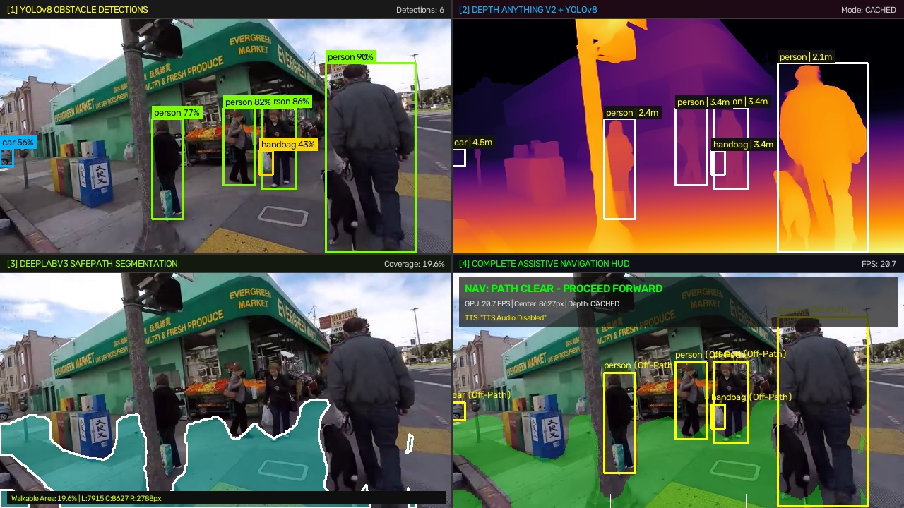

# Walkthrough: 4-Panel Quad-Stream in a Single Window (`quad_view_main.py`)

A new standalone Python script [`quad_view_main.py`](quad_view_main.py) has been created to provide a **single-window 2x2 grid (1280x720)** consolidating all perception and navigation layers simultaneously.

---

## 1. Visual Verification Artifact

Below is the verified composite frame captured directly from running the pipeline on `test_05_san_francisco_street.mp4`:



---

## 2. Panel Breakdown

| Quadrant | Title | Description & Improvements |
| :--- | :--- | :--- |
| **Panel 1 (Top-Left)** | **YOLOv8 Obstacle Detections** | Displays the camera frame with color-coded bounding boxes per class, class names (`person`, `car`, `handbag`), and confidence percentages (e.g., `person 90%`). |
| **Panel 2 (Top-Right)** | **Depth Anything V2 + YOLOv8** | **High-Resolution Upgrade:** Previously rendered only as a tiny 160x90 corner thumbnail. Now rendered at **full 640x360 resolution** with `COLORMAP_INFERNO`, overlaid with bounding boxes and metric distances in meters (e.g., `person | 2.1m`, `car | 4.5m`). |
| **Panel 3 (Bottom-Left)** | **DeepLabV3 SafePath Segmentation** | Shows the walkable path corridor (cyan overlay), the physical safety clearance boundary (7x7 erosion contour in white), and real-time coverage statistics (`Walkable Area: 19.6% | L:7915 C:8627 R:2788px`). |
| **Panel 4 (Bottom-Right)** | **Complete Assistive Navigation HUD** | The complete fusion stream: AR green walkable path, hazard danger categorization (Yellow = Off-Path, Red = On-Path Hazard), sector navigation guidance banner (`PROCEED FORWARD`, `VEER LEFT`, `VEER RIGHT`, `STOP / CAUTION`), GPU FPS telemetry, active TTS speech banner, and corridor guide markers. |

---

## 3. Key Pipeline Specifications

- **Single Window Layout**: Aggregated into a unified $1280 \times 720$ canvas via `np.vstack([np.hstack([p1, p2]), np.hstack([p3, p4])])`, with 2px high-contrast divider lines between quadrants.
- **Multi-Threaded Architecture**:
  - **Thread 1:** DeepLabV3 MobileNet SafePath Segmentation ($384 \times 256$).
  - **Thread 2:** YOLOv8 Hazards ($640 \times 480$) + Depth Anything V2 ($518 \times 518$) with alternating 2-frame cadence caching.
  - **Audio Worker:** Non-blocking SAPI Text-to-Speech synthesizer with 1000 Hz earcon beeps and Indian English accent detection.
  - **Main Display Thread:** Synchronizes bounded queues, builds the quad-view canvas, and renders the single window at ~21 FPS on GPU.

---

## 4. Verification & Testing Results

1. **Automated Headless & Snapshot Verification**:
   ```powershell
   ..\.venv\Scripts\python.exe quad_view_main.py --source test_05_san_francisco_street.mp4 --max-frames 25 --save-snapshot quad_preview.jpg --no-tts
   ```
   - **Result:** Successfully completed with exit code `0`. Verified output image resolution: $1280 \times 720$.

2. **Full Audio & Perception Verification**:
   ```powershell
   ..\.venv\Scripts\python.exe quad_view_main.py --source test_05_san_francisco_street.mp4 --max-frames 25
   ```
   - **Result:** Successfully completed with exit code `0`. Logged real-time speech dispatches:
     ```text
     [TTS AUDIO PRIORITY 3: GUIDANCE] >>> "Path is clear."
     [TTS AUDIO PRIORITY 2: DIRECTIONAL] >>> "Obstacle ahead. Veer right onto safe path." (Target: nav_veer_right)
     ```

---

## 5. Headless Assistive Navigation Engine (`main.py`)

`main.py` is configured as a **completely headless, edge-optimized navigation engine**:

- **No GUI by Default:** Zero OpenCV windows (`cv2.imshow` disabled), directing all user guidance to real-time TTS speech and 1000 Hz earcons.
- **Default Local Webcam:** Running `python main.py` automatically initializes the local machine webcam (Index 0) with Windows DirectShow for instant startup.
- **IP Webcam Support:** Accepts phone IP webcam streams with auto-normalization:
  ```powershell
  python main.py --ip 192.168.1.100:8080
  ```
- **Direct Video File Path:** Pass any video file path (relative or absolute) positionally or via `--video`:
  ```powershell
  python main.py path/to/video.mp4
  python main.py --video path/to/video.mp4
  ```
- **Optional GUI:** Add `--gui` if dual visual display windows are desired for debugging.
- **Graceful Termination:** Catching `KeyboardInterrupt` (`Ctrl+C`) releases camera hardware cleanly.

---

## 6. Execution Control & Performance Tuning (`--max-frames` vs. FPS)

### Understanding `--max-frames`:
* **`--max-frames N` (Automated Testing):** Tells the pipeline to cleanly terminate and exit after processing exactly $N$ frames (e.g. `--max-frames 25`). This is an automated exit criterion used for testing scripts and CI/benchmarking, **not** a frame rate.
* **`--max-frames 0` (Continuous Real-Time Execution — Default):** When `--max-frames` is omitted or set to `0`, the system runs continuously in real-time. Video files automatically loop back to frame 0 upon reaching the end until interrupted via `Ctrl+C`.

### Pipeline Frame Rate (FPS) & Throughput Tuning:
* **Steady State FPS:** The pipeline runs smoothly at **~20 to 25+ FPS** in Python and **~33.4 to 42.3 FPS** in native C++ on modern GPUs (e.g. RTX 3050 Laptop GPU).
* **Reaching Higher Throughput (30–42+ FPS):**
  - **Depth Cadence (`--depth-cadence`):** Depth Anything V2 ($518 \times 518$) is the most computationally intensive stage. By setting `--depth-cadence 3` or `4`, depth is computed once every 3–4 frames while cached depth is reused for intermediate frames, boosting throughput to **30–35+ FPS** in Python and **42.3+ FPS** in C++:
    ```powershell
    python main.py path/to/video.mp4 --depth-cadence 3
    .\build\Release\safepath.exe path\to\video.mp4 --headless --depth-cadence 3
    ```
  - **Headless Mode:** Leaving GUI disabled (the default in `main.py` and via `--headless` in `safepath.exe`) eliminates window rendering overhead, dedicating 100% of GPU resources to real-time AI perception and speech.

---

## 7. Dedicated Test Suite Organization (`full_test/test/`)

All testing, verification, and benchmarking codes have been moved out of the root project folder into a clean `full_test/test/` package:
* `test/test_audio.py`: Validates prioritized speech preemption, 1000 Hz proximity warning tones, and debounce cooldown timers.
* `test/benchmark_suite.py`: Multi-scenario real-world evaluation across downloaded pedestrian test videos.
* `test/verify_optimizations.py`: Cadence timing analysis and milestone visual snapshot generation.
* `test/check_onnx.py`: ONNX model input/output tensor shape validator.
* `test/test.py`: Standalone semantic segmentation visual test.


